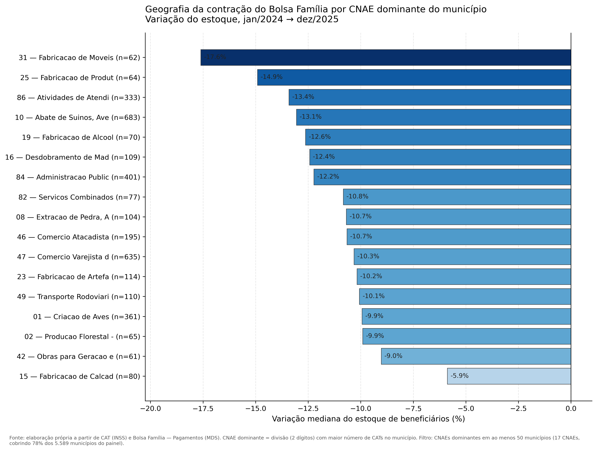
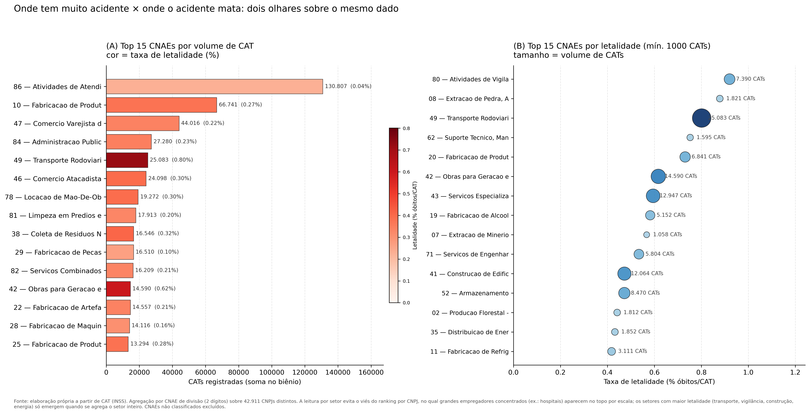
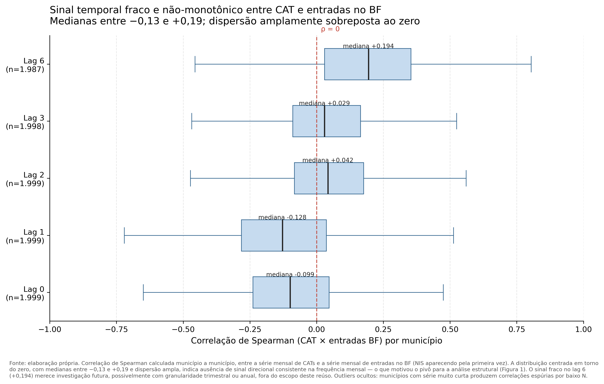

# Geografia da Contração do Bolsa Família

**Reúso de dados abertos — Concurso CGU de Reutilização, 2ª edição (2026)**

Cartografia municipal da variação do estoque de beneficiários do Bolsa Família entre janeiro de 2024 e dezembro de 2025, cruzada com o perfil setorial de acidentes de trabalho (CAT) de cada município. O período coincide com a revisão ativa do Cadastro Único, que produziu grande volume de saídas administrativas do programa em ritmo e geografia desiguais.

Este reúso combina duas bases públicas do portal dados.gov.br — **Bolsa Família — Pagamentos** (MDS) e **Comunicação de Acidente de Trabalho** (INSS) — em um painel municipal que permite três leituras distintas do mesmo período.

---

## O que este reúso mostra

**1. A contração do BF se distribuiu desigualmente pelo mapa, e essa desigualdade correlaciona com o perfil setorial dominante do município.**

Municípios cuja economia local é dominada por indústria de transformação, comércio e serviços administrativos perderam mediana de 12% a 18% do estoque de beneficiários no biênio. Municípios cuja economia é dominada por agricultura, avicultura, produção florestal ou fabricação de calçados perderam entre 6% e 10%. O gradiente é ordenado e visível em 17 divisões CNAE que juntas cobrem 78% dos 5.589 municípios brasileiros com dado no período.



**Uma pergunta que este reúso deliberadamente não fecha:** por que municípios de predominância agrícola quase não perderam beneficiários? Ao menos quatro hipóteses são compatíveis com o dado — capacidade operacional local do CRAS, perfil demográfico predominante, regularidade cadastral prévia, e vitalidade econômica setorial. Distinguir uma da outra exige cruzamento com RAIS (para renda formal) e dados operacionais do CadÚnico (para atualização cadastral), fora do escopo desta iteração.

**2. Onde tem muito acidente de trabalho não é onde o acidente mata.**

O ranking de setores econômicos por CAT registrada é dominado por Atividades de Atendimento à Saúde (131 mil CATs no biênio) — hospitais e clínicas reportam volume alto por escala de operação e cultura de registro, com letalidade baixíssima (0.04%). O ranking por taxa de letalidade traz outro conjunto: Vigilância Patrimonial (0.92%), Transporte Rodoviário (0.80%), Obras para Geração de Energia (0.62%), Construção de Edifícios (0.51%), Serviços Especializados de Construção. Em transporte, o óbito por CAT é vinte vezes o de hospitais.

O achado sobre Vigilância Patrimonial (CNAE 80) — 7.390 CATs no biênio com letalidade em torno de 0.9% — é substrato pouco lido publicamente e merece atenção específica.



**3. Acidente de trabalho e entrada no Bolsa Família não têm sinal temporal consistente na frequência mensal.**

A hipótese original deste reúso — de que o acidente de trabalho precederia a entrada da família na assistência social, com defasagem de poucos meses — não se sustenta no dado. A correlação de Spearman calculada município a município, testada em cinco defasagens (0, 1, 2, 3 e 6 meses), produz distribuição centrada em torno do zero, com medianas entre −0,13 e +0,19 e dispersão amplamente sobreposta a ele. O sinal fraco no lag 6 (+0,194) merece investigação futura, possivelmente com granularidade trimestral ou anual, mas não sustenta hipótese direcional nesta análise.



O resultado nulo está preservado neste reúso como parte do produto. A decisão de abandonar a tese temporal em favor da análise estrutural (Figuras 1 e 2) é metodologicamente exposta e reproduzível a partir dos dados fornecidos.

---

## O que este reúso **não** afirma

- Que o setor econômico dominante *causa* a variação do estoque de BF no município. O gradiente é descritivo — correlação ecológica municipal, não relação causal individual.
- Que hospitais e clínicas são setores particularmente inseguros. Volume alto de CAT combinado com letalidade baixa indica cultura de registro robusta e exposição a acidentes leves, não desamparo do trabalhador.
- Que empresas nomeadas no ranking por CNPJ (disponível como artefato de apoio em `outputs/`) sejam responsáveis por padrões setoriais. A leitura por CNPJ carrega viés de escala que só se corrige com normalização por folha de pagamento (RAIS), fora do escopo desta iteração.
- Que o acidente de trabalho, no biênio analisado, tenha precedido a entrada da família no BF de modo mensal e detectável. O sinal medido é fraco e não-monotônico.

A régua editorial deste reúso é a de que dado público sério pede afirmação sóbria. As perguntas em aberto ficam abertas, com o caminho técnico para respondê-las descrito no [`metodologia.md`](metodologia.md).

---

## Bases utilizadas

**Bolsa Família — Pagamentos** (MDS, via Portal da Transparência)
- Cobertura: janeiro/2024 a dezembro/2025 (25 meses, incluindo warm-up de dezembro/2023)
- Granularidade: registro individual por NIS × mês × município de pagamento
- Volume bruto: dezenas de milhões de linhas por mês

**Comunicação de Acidente de Trabalho — CAT** (INSS, via dados.gov.br)
- Cobertura: janeiro/2024 a dezembro/2025 (24 meses)
- Granularidade: uma linha por CAT emitida — CNPJ do empregador, CNAE, município do acidente, tipo (típico, trajeto, doença), CID, óbito
- Volume bruto: mais de 1 milhão de registros por ano

**Tabela auxiliar de municípios** (SIAFI × IBGE7)

Toda a coleta é reproduzível a partir dos scripts `pipeline/download_bf.sh` e `pipeline/download_cat.sh`.

---

## Como reproduzir

```bash
# Coleta (executar uma vez; pesado, requer conexão estável)
bash pipeline/download_bf.sh
bash pipeline/download_cat.sh

# Processamento (recomendado em máquina com ≥ 16GB RAM)
python pipeline/build_painel.py
python pipeline/agrega_cat_cnae.py
python pipeline/cruza_estrutural.py
python pipeline/analise_correlacao.py

# Figuras (leves; qualquer máquina)
python figuras/fig1_gradiente_cnae.py
python figuras/fig2_cnae_volume_letalidade.py
python figuras/fig3_correlacoes_temporais.py
```

Documentação técnica completa, decisões metodológicas, limitações e próximos passos: [`metodologia.md`](metodologia.md).

---

## Artefatos disponíveis

Em `data/processed/`:

- `painel_estrutural.parquet` — 5.589 municípios, com CNAE dominante, variação BF no período, agregações CAT por tipo de CID
- `painel_municipio_mes.parquet` — série mensal por município (25 meses × 5.589 municípios)
- `cat_cnpj_ranking.parquet` — 42.911 CNPJs empregadores, CATs por tipo, letalidade
- `cat_cnae_mun.parquet` — matriz longa CNAE × município
- `correlacoes_municipais.parquet` — correlações temporais Spearman por município e por defasagem
- `cat_cnae_secao_dic.parquet` — dicionário CNAE

---

## Licença

Código: MIT.
Dados derivados e figuras: CC BY 4.0.

Atribuição sugerida: *Camargo, G. (2026). Geografia da Contração do Bolsa Família. Reúso de dados abertos. Concurso CGU de Reutilização, 2ª edição.*

---

*Este reúso foi construído durante os primeiros 11 dias de setembro de 2026 em ambiente doméstico, em duas máquinas (MacBook Pro 2017 e desktop AMD Ryzen 7 1700), usando exclusivamente ferramentas abertas: Python, DuckDB, pandas, matplotlib. Nenhuma infraestrutura de nuvem foi utilizada. O objetivo é demonstrar que reúso de dados públicos brasileiros de escala nacional é factível fora de ambientes institucionais.*
